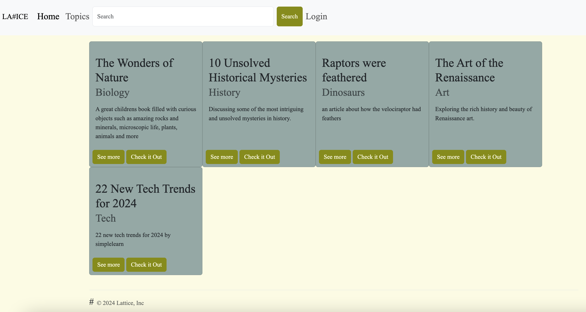
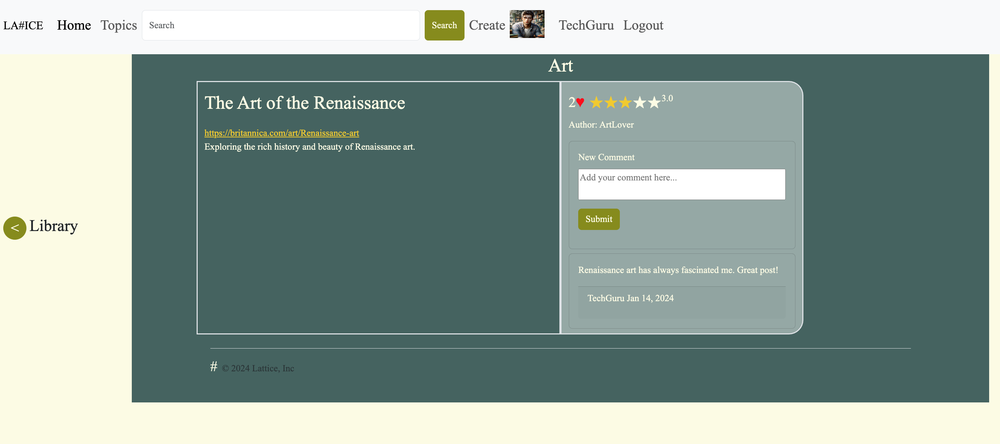

LHL Midterm Project - David, Dhaarani, and Roderick
=========

# Lattice

## Resource Wall: Collaborative Learning Platform

Resource Wall is a platform for learners to save, share, and discover learning resources like tutorials, blogs, and videos. It's a community-driven tool, allowing users to interact with resources through comments, ratings, and likes.

## Screenshots

## Features:

- Save Resources: Add learning materials with a title, description, and URL.
- Search and Discover: Find resources added by others.
- Categorize Resources: Organize materials under specific topics.
- Interact with Content: Comment, rate, and like resources.
- Personal Dashboard: Access your own and liked resources easily.
- Edit Profile: Update personal information.

## Whats inside:

- Tech Stack: Node.js, Express, EJS, Cookie-Session, Bootstrap
- Database: Postgres
- Planning Docs, Wireframes, and DB schema can be found contained in "Project-Planning" directory

## Getting Started

1. Create the `.env` by using `.env.example`
2. Create a postgres database and update the .env file with your correct local database information
Example DB:
  - database: `midterm`
  - username: `labber` 
  - password: `labber` 
3. Install dependencies: `npm i`
4. Fix to binaries for sass: `npm rebuild node-sass`
5. Reset database: `npm run db:reset`
  - Check the db folder to see what gets created and seeded in the SDB
7. Run the server: `npm run local`
  - Note: nodemon is used, so you should not have to restart your server
8. Visit `http://localhost:8080/`

## Dependencies

- Node 10.x or above
- NPM 5.x or above
- PG 6.x
